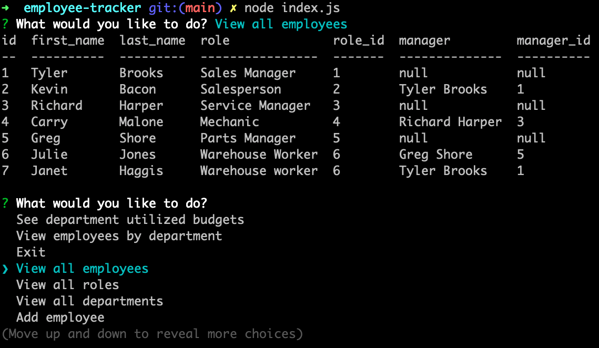

# Employee Tracker

## Description

A command-line content management system (CMS) that allows a user (business owner) to view and manage the departments, roles, and employees in their company. The application is straight forward to navigate through and use.

[Watch a walkthrough HERE](https://youtu.be/kUIVknzlyvs)

## Usage

After initializing the database(running schema.sql), connecting the server(node server.js) to create table models, and optionaly seeding the tables with starting json data (npm run seed), user should run the following command to start the application:

```
node index.js
```


